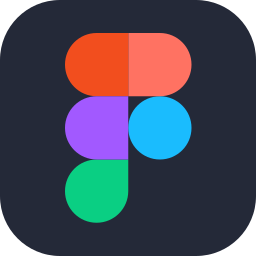

### Hello 👋, I'm Lucas, a.k.a Vincere.
Full-Stack DEV,  UX/UI & Branding Designer, SEO Analyst and Audiovisual Producer.
🏅100+ Certificates (Alura,Udemy,Google,AWS,Azure)

  

#### Active Projects (by me):
[CorrigeABC](https://corrigeabc.com/).
[Texthance](https://texthance.com/).
[Discoframe](https://discoframe.com/).
[AgenciaGreater](https://agenciagreater.com/).
[OlimpusHost](https://olimpushost.com/).
[EaseShare](https://easeshare.app/).

#
#### Languages/Softwares/Tools/Librarys i've worked with:

  
  <!-- Cloud Computing Knowledge -->
  
  
  
  

  <!-- Languages I know -->
  
  
  
  
  
  
  

  <!-- Libraries/Frameworks -->
  
  
  
  
  
  
  

  <!-- IDE -->
  
  
  

  <!-- Platforms/Softwares -->
  
  
  
  
  
  
  

  <!-- Visual/Audio Design Tools & Softwares -->

  
  
  
  
  
  

  <!-- Visual/Audio Design Tools & Softwares -->

  
  
  
  
  
  

> [!NOTE]
> I have extensive knowledge in various areas and resources, acquired out of necessity in projects where I had to learn almost everything to complete them 💪
#
