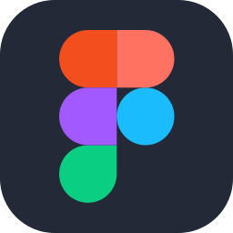

### Hello 👋, I'm Lucas, a.k.a Vincere.

WIP Software Architect.
Self-taught Full-Stack Dev, UX/UI & Branding Designer.

  

#### Projects (by me):
[FraseMix](https://frasemix.com/). - First ever project i built in 2022-2023, it has reached already 1k+ users.

[Texthance]. (didn't worked out) AI tool for quick text edit.

[Discoframe] (didn't worked out) SaaS for discord, bot.

[AgenciaGreater] My own Design and Branding agency. not active anymore.

[OlimpusHost] (didn't worked out)

[EaseShare] (didn't worked out)

[disgram.gg](https://disgram.gg/). Recent project, related to Discord platform. Disgram is a way for servers to advertise events, giveaways, their own guild and achievements.

#
#### Languages/Softwares/Tools/Librarys i've worked with:

  
  <!-- Cloud Computing Knowledge -->
  
  
  

  <!-- Languages I know -->
  
  
  
  
  
  <!-- Libraries/Frameworks -->
  
  
  

  <!-- IDE -->
  
  
  

  <!-- Platforms/Softwares -->
  
  
  
  

  <!-- Visual/Audio Design Tools & Softwares -->
  
  
  
  
  
  

  <!-- Visual/Audio Design Tools & Softwares -->
  
  
  
  
  
  

> [!NOTE]
> I have extensive knowledge in various areas and resources, acquired out of necessity in projects where I had to learn almost everything to complete them
#
